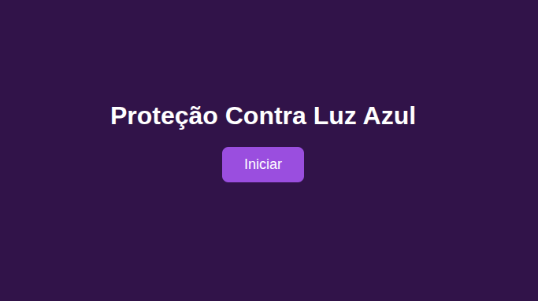
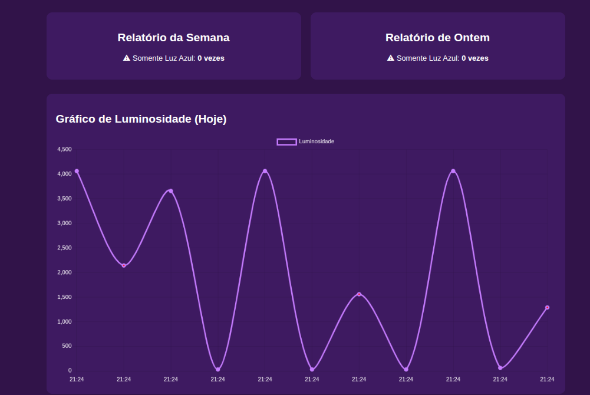
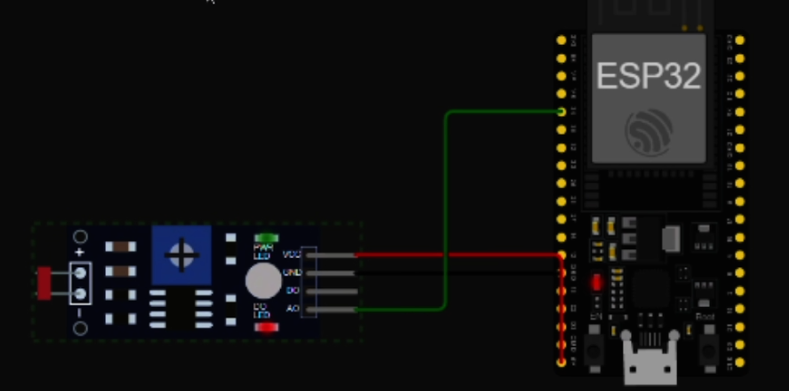

# Monitoramento de Luz Azul com ESP32 e Flask

## Descrição do Projeto
Este projeto monitora a luminosidade ambiente para detectar quando uma pessoa está exposta apenas à luz azul de aparelhos (computador, celular, tablet), sem iluminação adicional de lâmpadas. O objetivo é prevenir fadiga ocular e outros efeitos da exposição prolongada à luz azul.

O sistema usa um ESP32 com sensor LDR para medir a luz, classifica os níveis em três estados, envia os dados via MQTT na nuvem e exibe gráficos em tempo real em uma interface web feita com Flask e Socket.IO.

Luminosidade baixa → pouca ou nenhuma luz → OK  
Luminosidade média → apenas luz azul de aparelhos → ALERTA  
Luminosidade alta → muita luz ambiente → OK  

## Componentes
ESP32  
Sensor LDR (pino 34)  
LED onboard (GPIO2) para indicar alerta local  
Broker MQTT na nuvem (IP configurável)  
Servidor Flask com Socket.IO  
Python 3.x com bibliotecas:  pip install flask flask-socketio paho-mqtt

Link do Wokwi (simulação): [Clique aqui para acessar](https://wokwi.com/projects/447912423480228865)

## Configuração do ESP32

### Hardware
Conecte o LDR ao pino 34.  
Use o LED onboard para indicar estado de alerta (acende somente quando a luminosidade é média).  

### Código
Configure a rede Wi-Fi e valores de Luminosidade do LDR

### Estados
0 - Muito baixa (escuro) → LED apagado → OK – pouca ou nenhuma luz, ambiente seguro  
1 - Média (intermediária) → LED aceso → ALERTA – apenas luz azul da tela, ruim para os olhos  
2 - Alta (claro) → LED apagado → OK – muita luz ambiente, impossível ser só a tela  

## Funcionalidades da Interface
Gráfico em tempo real da luminosidade medida hoje.  
Relatórios: Semana e Ontem mostrando número de vezes que a luz média (apenas tela azul) foi detectada.  
Alertas visuais: pop-up no navegador quando a luminosidade está no estado intermediário (ALERTA).  
Pontos do gráfico: vermelhos para ALERTA, roxos para OK.

## MQTT
Tópico de publicação (ESP32 → Flask): /TEF/device069/attrs  

Payload JSON enviado pelo ESP32:
{
"status": "OK | ALERTA",
"nivel": "BAIXO | INTERMEDIARIO | ALTO",
"mensagem": "descrição do estado",
"ldr": 1234
}

## Atualização e Relatórios
O Python recebe os dados, atualiza gráficos em tempo real e mantém relatórios diários e semanais.

## Observações
Ajuste LDR_BRIGHT_MAX e LDR_DARK_MIN conforme medições reais do seu sensor.  
O LED do ESP32 indica alerta local, enquanto a interface web oferece gráficos e relatórios históricos.  
O estado intermediário é considerado ruim, pois indica que a pessoa está trabalhando apenas com a luz azul da tela, sem iluminação adequada.

## Fotos do Projeto
Insira abaixo fotos do ESP32, LDR e da interface web em funcionamento:  
  
  

## Integrantes do Grupo
Thiago Lima Cavalcanti - RM563416  
Vitor Alcantra - RM565885  
Matheus Vasques - RM563309 
